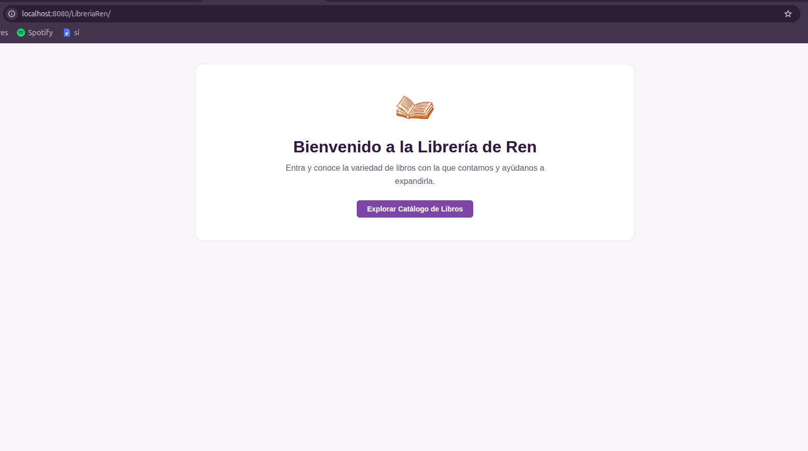
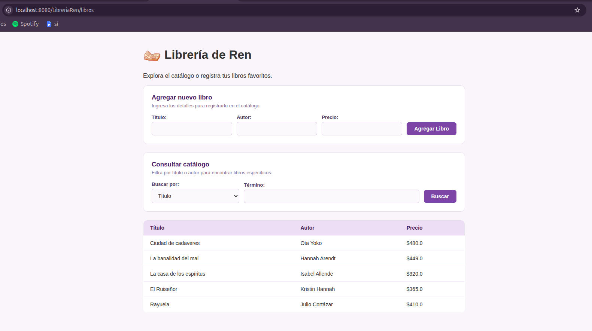
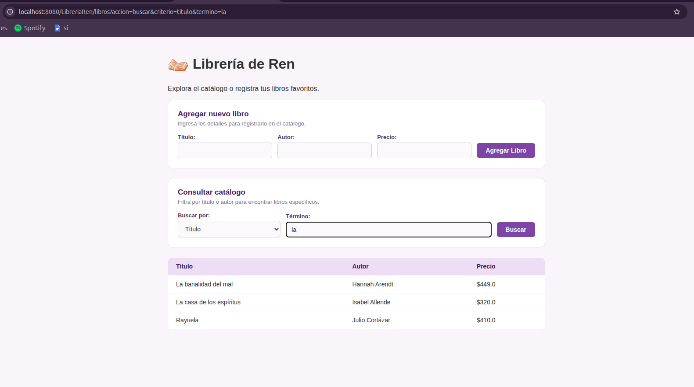

# Librería de Ren - Práctica Web MVC

Proyecto web para administrar y buscar libros usando Java (Servlets y JSP), conexión JDBC y base de datos en MySQL.

---

## Versiones utilizadas

Para que el proyecto corra sin problemas de compatibilidad, se utilizaron estas versiones:

* Java: JDK 21
* Servidor: Apache Tomcat 10.1
* Base de datos: MySQL Server 8.0
* Conector JDBC: mysql-connector-j-8.4.0.jar

---

## Base de datos

1. Entrar a MySQL en la terminal:
sudo mysql

2. Crear la base de datos, el usuario y darle permisos:
CREATE DATABASE IF NOT EXISTS bookdb;
CREATE USER IF NOT EXISTS 'ren'@'localhost' IDENTIFIED BY 'admin';
GRANT ALL PRIVILEGES ON bookdb.* TO 'ren'@'localhost';
FLUSH PRIVILEGES;

3. Crear la tabla:
USE bookdb;
CREATE TABLE IF NOT EXISTS books (
    id INT AUTO_INCREMENT PRIMARY KEY,
    title VARCHAR(150) NOT NULL,
    author VARCHAR(100) NOT NULL,
    price DECIMAL(8, 2) NOT NULL);

---

## Cómo levantarlo en NetBeans

1. Abrir el proyecto LibreriaRen en NetBeans.
2. Checar que el archivo mysql-connector-j-8.4.0.jar esté en la carpeta Libraries y dentro de web/WEB-INF/lib/.
3. Dar clic derecho al proyecto y seleccionar Clean and Build.
4. Dar clic derecho y seleccionar Run.
5. Abrir en el navegador:
http://localhost:8080/LibreriaRen/

---

## Capturas de funcionamiento

### 1. Portada de inicio (index.html)

### 2. Catálogo completo de libros

### 3. Búsqueda por título con la palabra "la"
